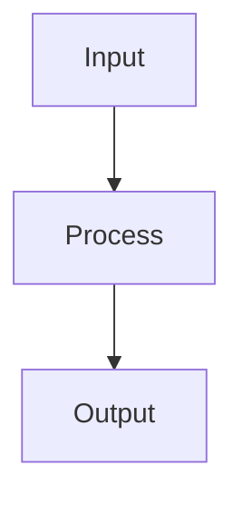

# Generate Notes Endpoint Documentation

## Overview

The `/generate_notes` endpoint creates comprehensive, well-formatted markdown study notes from any document in the system. It supports different academic levels and includes diagrams, mermaid visualizations, and hierarchical organization for optimal learning.

## Endpoint Details

### URL

```
POST /generate_notes
```

### Content Type

```
multipart/form-data
```

### Authentication

None required (handled through space_id and document access controls)

---

## Parameters

### Required Parameters

| Parameter     | Type   | Description                                |
| ------------- | ------ | ------------------------------------------ |
| `document_id` | string | UUID of the document to generate notes for |

### Optional Parameters

| Parameter          | Type    | Default    | Description                                                      |
| ------------------ | ------- | ---------- | ---------------------------------------------------------------- |
| `space_id`         | string  | null       | Optional space ID for filtering document access                  |
| `academic_level`   | string  | "graduate" | Target academic level: "undergraduate", "graduate", "msc", "phd" |
| `include_diagrams` | boolean | true       | Whether to include diagrams extracted from PDFs                  |
| `include_mermaid`  | boolean | true       | Whether to generate mermaid diagram visualizations               |
| `max_chunks`       | integer | 2000       | Maximum number of content chunks to process                      |
| `acl_tags`         | string  | null       | Comma-separated ACL tags for content filtering                   |

---

## Academic Levels

### Undergraduate Level

- **Focus**: Clear explanations with examples
- **Style**: Foundational concepts with practical applications
- **Examples**: Step-by-step processes, real-world analogies

### Graduate Level

- **Focus**: Advanced analysis with frameworks
- **Style**: Critical thinking, theoretical foundations
- **Examples**: Methodological comparisons, case studies

### MSc Level

- **Focus**: Technical depth with methodologies
- **Style**: Research-oriented, quantitative approaches
- **Examples**: Statistical methods, experimental design

### PhD Level

- **Focus**: Critical analysis with research gaps
- **Style**: Scholarly critique, emerging trends
- **Examples**: Theoretical debates, future research directions

---

## Request Examples

### Basic Request (Graduate Level)

```bash
curl -X POST "http://localhost:8000/generate_notes" \
  -F "document_id=abc123-def456-ghi789" \
  -F "academic_level=graduate"
```

### Advanced Request (PhD Level with All Features)

```bash
curl -X POST "http://localhost:8000/generate_notes" \
  -F "document_id=abc123-def456-ghi789" \
  -F "space_id=space-uuid-123" \
  -F "academic_level=phd" \
  -F "include_diagrams=true" \
  -F "include_mermaid=true" \
  -F "max_chunks=3000" \
  -F "acl_tags=research,advanced"
```

### Undergraduate Request (Simplified)

```bash
curl -X POST "http://localhost:8000/generate_notes" \
  -F "document_id=abc123-def456-ghi789" \
  -F "academic_level=undergraduate" \
  -F "include_diagrams=false" \
  -F "include_mermaid=false"
```

---

## Response Format

### Success Response (200)

````json
{
  "notes_markdown": "# Complete Study Notes\n\n## Chapter 1: Introduction\n\n### Key Concepts\n- Concept 1: Detailed explanation with examples\n- Concept 2: Practical applications\n\n## Chapter 2: Advanced Topics\n\n### Theoretical Framework\n- Framework analysis\n- Comparative studies\n\n```mermaid\ngraph TD\n    A[Start] --> B[Process]\n    B --> C[End]\n```\n\n### Diagrams\n\n",
  "metadata": {
    "academic_level": "graduate",
    "total_pages": 120,
    "total_chapters": 8,
    "total_chunks_processed": 350,
    "diagrams_included": 12,
    "generation_time_seconds": 145.2,
    "coverage_score": 0.98,
    "notes_length_chars": 50000,
    "generated_at": "2025-11-04T10:30:45Z"
  },
  "status": "success",
  "saved_to_database": true,
  "content_id": "content-uuid-123",
  "saved_to_file": "/path/to/notes/document_id_graduate_20251104_103045.md"
}
````

### Error Response (400 - Invalid Academic Level)

```json
{
  "error": "Invalid academic_level. Must be one of: undergraduate, graduate, msc, phd",
  "status": "error"
}
```

### Error Response (500 - Processing Error)

```json
{
  "notes_markdown": "",
  "metadata": {},
  "status": "error",
  "message": "Failed to process document chunks"
}
```

---

## Response Fields

### Core Fields

| Field            | Type   | Description                             |
| ---------------- | ------ | --------------------------------------- |
| `notes_markdown` | string | Complete markdown-formatted study notes |
| `metadata`       | object | Processing metadata and statistics      |
| `status`         | string | "success" or "error"                    |

### Metadata Object

| Field                     | Type    | Description                        |
| ------------------------- | ------- | ---------------------------------- |
| `academic_level`          | string  | Academic level used for generation |
| `total_pages`             | integer | Total pages in source document     |
| `total_chapters`          | integer | Number of chapters identified      |
| `total_chunks_processed`  | integer | Number of content chunks processed |
| `diagrams_included`       | integer | Number of diagrams embedded        |
| `generation_time_seconds` | float   | Time taken to generate notes       |
| `coverage_score`          | float   | Content coverage quality (0.0-1.0) |
| `notes_length_chars`      | integer | Character count of generated notes |
| `generated_at`            | string  | ISO timestamp of generation        |

### Additional Fields (Success Only)

| Field               | Type    | Description                          |
| ------------------- | ------- | ------------------------------------ |
| `saved_to_database` | boolean | Whether notes were saved to database |
| `content_id`        | string  | Database content ID if saved         |
| `saved_to_file`     | string  | File path if saved to filesystem     |

---

## Generated Notes Structure

The generated notes follow a hierarchical markdown structure:

````markdown
# Document Title

## Table of Contents

- [Chapter 1: Introduction](#chapter-1)
- [Chapter 2: Core Concepts](#chapter-2)

## Chapter 1: Introduction

### Key Learning Objectives

- Objective 1
- Objective 2

### Main Concepts

- **Concept 1**: Detailed explanation with examples
- **Concept 2**: Practical applications and use cases

### Important Diagrams


### Mermaid Visualizations


````

## Chapter 2: Core Concepts

### Advanced Theory

- Theoretical foundations
- Mathematical formulations (where applicable)

### Case Studies

- Real-world examples
- Comparative analysis

### Critical Analysis

- Strengths and limitations
- Research gaps and future directions

## References & Further Reading

- Primary sources
- Recommended texts
- Online resources

````

---

## Features

### Content Processing
- **Hierarchical Organization**: Chapters, sections, subsections
- **Academic Level Adaptation**: Content complexity matches target level
- **Comprehensive Coverage**: Every detail from source document
- **Quality Enhancement**: Improved clarity and readability

### Visual Elements
- **Diagram Extraction**: Automatic PDF diagram extraction
- **Mermaid Diagrams**: Generated flowchart and relationship visualizations
- **Image Embedding**: Base64 encoded images in markdown

### Quality Metrics
- **Coverage Score**: Measures completeness of content capture
- **Processing Stats**: Detailed metrics on chunks processed
- **Performance Tracking**: Generation time and efficiency metrics

### Persistence
- **Database Storage**: Saved to `generated_content` table
- **File Storage**: Markdown files saved to `note/` directory
- **Metadata Tracking**: Complete audit trail of generation

---

## Error Handling

### Common Error Scenarios

1. **Invalid Document ID**
   - Returns 500 with error message
   - Check document exists in system

2. **Invalid Academic Level**
   - Returns 400 with validation error
   - Must be: undergraduate, graduate, msc, phd

3. **No Content Chunks**
   - Returns 500 with processing error
   - Document may not be properly chunked

4. **Database Save Failure**
   - Returns success but with `saved_to_database: false`
   - `database_save_error` field contains details
   - Notes still generated and returned

5. **File Save Failure**
   - Returns success but with `saved_to_file` null
   - `file_save_error` field contains details
   - Notes still generated and returned

---

## Integration Examples

### JavaScript/Node.js
```javascript
const FormData = require('form-data');
const fetch = require('node-fetch');

async function generateNotes(documentId, academicLevel = 'graduate') {
  const formData = new FormData();
  formData.append('document_id', documentId);
  formData.append('academic_level', academicLevel);
  formData.append('include_diagrams', 'true');
  formData.append('include_mermaid', 'true');

  const response = await fetch('http://localhost:8000/generate_notes', {
    method: 'POST',
    body: formData
  });

  const result = await response.json();

  if (result.status === 'success') {
    console.log('Notes generated:', result.notes_markdown.length, 'characters');
    console.log('Coverage score:', result.metadata.coverage_score);
    return result;
  } else {
    throw new Error(result.message || 'Failed to generate notes');
  }
}
````

### Python

```python
import requests

def generate_notes(document_id, academic_level='graduate', space_id=None):
    url = "http://localhost:8000/generate_notes"

    data = {
        'document_id': document_id,
        'academic_level': academic_level,
        'include_diagrams': 'true',
        'include_mermaid': 'true'
    }

    if space_id:
        data['space_id'] = space_id

    response = requests.post(url, data=data)

    if response.status_code == 200:
        result = response.json()
        if result['status'] == 'success':
            print(f"Generated {result['metadata']['notes_length_chars']} characters")
            return result['notes_markdown']
        else:
            raise Exception(result.get('message', 'Generation failed'))
    else:
        raise Exception(f"HTTP {response.status_code}: {response.text}")
```

### cURL with File Output

```bash
curl -X POST "http://localhost:8000/generate_notes" \
  -F "document_id=abc123-def456-ghi789" \
  -F "academic_level=graduate" \
  -o notes_response.json

# Extract markdown to file
cat notes_response.json | jq -r '.notes_markdown' > study_notes.md
```

---

## Performance Considerations

### Processing Time

- **Typical Range**: 30-300 seconds depending on document size
- **Factors**: Document length, diagram count, academic level complexity
- **Optimization**: Use `max_chunks` to limit processing for large documents

### Memory Usage

- **Large Documents**: Consider chunk limits for memory efficiency
- **Diagram Processing**: PNG extraction can be memory-intensive
- **Mermaid Generation**: Additional processing for complex visualizations

### Rate Limiting

- **Concurrent Requests**: Consider queuing for multiple large documents
- **Resource Usage**: Monitor system resources during generation
- **Caching**: Generated notes are cached in database for reuse

---

## Database Schema

### Generated Content Table

```sql
CREATE TABLE generated_content (
  id UUID PRIMARY KEY DEFAULT gen_random_uuid(),
  document_id UUID NOT NULL,
  content_type VARCHAR(50) NOT NULL, -- 'notes'
  content TEXT NOT NULL, -- markdown notes
  metadata JSONB,
  space_id UUID,
  created_at TIMESTAMP WITH TIME ZONE DEFAULT NOW(),
  updated_at TIMESTAMP WITH TIME ZONE DEFAULT NOW()
);
```

### File Storage

- **Directory**: `note/` (relative to project root)
- **Naming**: `{document_id}_{academic_level}_{timestamp}.md`
- **Format**: Standard markdown with embedded images

---

## Monitoring & Debugging

### Key Metrics to Monitor

- Generation success rate
- Average processing time by academic level
- Coverage scores distribution
- Error rates by error type

### Debug Information

- Check `pipeline.py` logs for detailed processing information
- Database `generated_content` table for persistence status
- File system `note/` directory for file storage status

### Common Issues

1. **Empty Notes**: Check if document has content chunks
2. **Missing Diagrams**: Verify PDF has extractable images
3. **Long Processing**: Reduce `max_chunks` or check document size
4. **Database Errors**: Check space_id validity and permissions

---

## API Version History

### v1.0 (Current)

- Initial implementation with all academic levels
- Diagram and mermaid support
- Database and file persistence
- Comprehensive metadata tracking

---

## Support

For integration questions or issues:

1. Check this documentation first
2. Review error messages in API responses
3. Examine server logs for detailed error information
4. Test with smaller documents first
5. Verify document_id and space_id validity

---

_Last updated: November 2025_
