# 📚 1744613183577

**Academic Level:** Graduate
**Document Type:** document
**Total Pages:** 0
**Total Chapters:** 1

---

## 📋 Document Overview

These comprehensive study notes cover all content from the source document, organized hierarchically and formatted for optimal learning at the graduate level.

---

## 🔍 Chapter 1: Pages 0-0

# Prompt Engineering
## Introduction

Prompt engineering is the process of designing high-quality prompts that guide Large Language Models (LLMs) to produce accurate outputs. This process involves optimizing prompt length, evaluating writing style and structure, and setting model configurations.

### Key Aspects of Prompt Engineering

* **Model selection**: Choosing a suitable LLM for the task
* **Prompt design**: Crafting a clear and effective prompt
* **Model configuration**: Setting optimal configuration options for the LLM

## LLM Output Configuration

LLMs have various configuration options that control the output. Effective prompt engineering requires setting these configurations optimally for the task.

### Output Length

* Controls the number of tokens generated in a response
* Reducing output length doesn't make the LLM more succinct, it just stops predicting tokens once the limit is reached
* Important for prompting techniques like ReAct

### Sampling Controls

* **Temperature**: Controls the degree of randomness in token selection
	+ Lower temperatures for deterministic responses
	+ Higher temperatures for diverse or unexpected results
* **Top-K**: Selects the top K most likely tokens from the predicted distribution
	+ Higher top-K for more creative and varied output
	+ Lower top-K for more restrictive and factual output
* **Top-P**: Selects the top tokens whose cumulative probability doesn't exceed a certain value (P)
	+ Values range from 0 (greedy decoding) to 1 (all tokens in the LLM's vocabulary)

### Configuring LLMs

* **Temperature**: 0 (greedy decoding) to high values (e.g., 10)
* **Top-K**: 1 (greedy decoding) to high values (e.g., size of the LLM's vocabulary)
* **Top-P**: 0 (greedy decoding) to 1
* A general starting point: temperature = 0.2, top-P = 0.95, top-K = 30

## Prompting Techniques

### General Prompting / Zero-Shot

* Simplest type of prompt
* Provides a description of a task and some text for the LLM to get started with
* No examples are given

**Example: Zero-Shot Prompt for Movie Review Classification**

| Name | 1_1_movie_classification |  |  |
| --- | --- | --- | --- |
| Goal | Classify movie reviews as positive, neutral or negative. |  |  |

### One-Shot & Few-Shot

* **One-shot**: Provides a single example
* **Few-shot**: Provides multiple examples
* Helps the LLM understand the task and generate more accurate responses

### System, Contextual, and Role Prompting

* **System prompting**: Provides context and instructions for the LLM
* **Role prompting**: Specifies the role or persona the LLM should adopt
* **Contextual prompting**: Provides additional context for the LLM to understand the task

### Step-Back Prompting

* Encourages the LLM to think more critically and generate more accurate responses
* Involves asking the LLM to explain its reasoning or provide evidence

### Chain of Thought (CoT)

* Encourages the LLM to generate a step-by-step solution
* Helps to improve the accuracy and transparency of the LLM's responses

### Self-Consistency

* Involves generating multiple responses and selecting the most consistent one
* Helps to improve the accuracy and reliability of the LLM's responses

### Tree of Thoughts (ToT)

* A more advanced prompting technique that involves generating multiple responses and evaluating them
* Helps to improve the accuracy and creativity of the LLM's responses

### ReAct

* A prompting technique that involves combining reasoning and acting
* Helps to improve the accuracy and effectiveness of the LLM's responses

### Automatic Prompt Engineering

* Involves using algorithms to automatically generate and optimize prompts
* Helps to improve the efficiency and effectiveness of prompt engineering

### Code Prompting

* Involves using prompts to generate, explain, or translate code
* Requires a deep understanding of programming languages and software development

## Best Practices

### Provide Examples

* Helps the LLM understand the task and generate more accurate responses

### Design with Simplicity

* Keep the prompt simple and concise
* Avoid unnecessary complexity

### Be Specific about the Output

* Clearly specify what you want the LLM to generate
* Helps to improve the accuracy and relevance of the response

### Use Instructions over Constraints

* Use instructions to guide the LLM's response
* Avoid using constraints that can limit the LLM's creativity

### Control the Max Token Length

* Helps to prevent the LLM from generating too much text
* Improves the efficiency and effectiveness of the response

### Use Variables in Prompts

* Helps to make the prompt more flexible and adaptable
* Improves the reusability of the prompt

### Experiment with Input Formats and Writing Styles

* Helps to improve the creativity and effectiveness of the response
* Encourages the LLM to think outside the box

### For Few-Shot Prompting with Classification Tasks, Mix Up the Classes

* Helps to improve the accuracy and generalizability of the LLM's responses
* Avoids bias and overfitting

### Adapt to Model Updates

* LLMs are constantly evolving and improving
* Stay up-to-date with the latest developments and adjust your prompts accordingly

### Experiment with Output Formats

* Helps to improve the creativity and effectiveness of the response
* Encourages the LLM to think outside the box

## JSON Repair

* A technique for repairing and improving JSON output
* Helps to improve the accuracy and reliability of the LLM's responses

## Working with Schemas

* Involves using schemas to guide the LLM's responses
* Helps to improve the accuracy and relevance of the response

## CoT Best Practices

* **Document the various prompt attempts**: Keep track of your prompt engineering work
* **Experiment together with other prompt engineers**: Collaborate and share knowledge

## Summary

Prompt engineering is a critical aspect of working with LLMs. By understanding the different prompting techniques and best practices, you can improve the accuracy, relevance, and effectiveness of the LLM's responses.

```mermaid
graph TD
    A[Prompting Techniques] --> B[General Prompting]
    A --> C[One-shot & Few-shot]
    A --> D[System Prompting]
    A --> E[Role Prompting]
    A --> F[Contextual Prompting]
    A --> G[Step-back Prompting]
    A --> H[Chain of Thought]
    A --> I[Self-Consistency]
    A --> J[Tree of Thoughts]
    A --> K[ReAct]
    A --> L[Automatic Prompt Engineering]
    A --> M[Code Prompting]

    B --> N[Provide Examples]
    C --> O[Design with Simplicity]
    D --> P[Be Specific about Output]
    E --> Q[Use Instructions over Constraints]
    F --> R[Control Max Token Length]
    G --> S[Use Variables in Prompts]
    H --> T[Experiment with Input Formats]
    I --> U[Adapt to Model Updates]
    J --> V[Experiment with Output Formats]

    style A fill:#f9f,stroke:#333,stroke-width:4px
    style B fill:#ccc,stroke:#333,stroke-width:2px
    style C fill:#ccc,stroke:#333,stroke-width:2px
    style D fill:#ccc,stroke:#333,stroke-width:2px
    style E fill:#ccc,stroke:#333,stroke-width:2px
    style F fill:#ccc,stroke:#333,stroke-width:2px
    style G fill:#ccc,stroke:#333,stroke-width:2px
    style H fill:#ccc,stroke:#333,stroke-width:2px
    style I fill:#ccc,stroke:#333,stroke-width:2px
    style J fill:#ccc,stroke:#333,stroke-width:2px
    style K fill:#ccc,stroke:#333,stroke-width:2px
    style L fill:#ccc,stroke:#333,stroke-width:2px
    style M fill:#ccc,stroke:#333,stroke-width:2px
    style N fill:#ccc,stroke:#333,stroke-width:2px
    style O fill:#ccc,stroke:#333,stroke-width:2px
    style P fill:#ccc,stroke:#333,stroke-width:2px
    style Q fill:#ccc,stroke:#333,stroke-width:2px
    style R fill:#ccc,stroke:#333,stroke-width:2px
    style S fill:#ccc,stroke:#333,stroke-width:2px
    style T fill:#ccc,stroke:#333,stroke-width:2px
    style U fill:#ccc,stroke:#333,stroke-width:2px
    style V fill:#ccc,stroke:#333,stroke-width:2px
```

