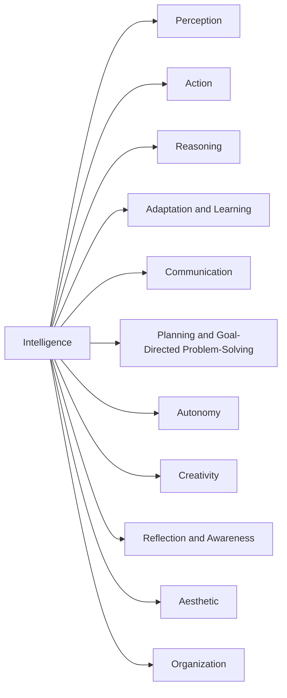
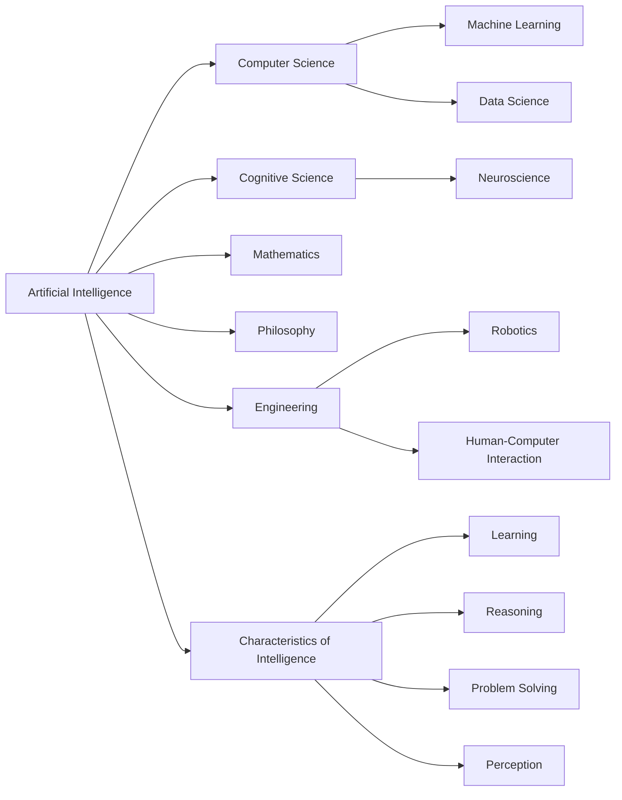
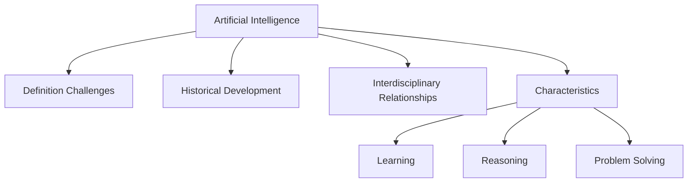

# 📚 Artificial Intelligence An Overview

**Academic Level:** Graduate
**Document Type:** research_paper
**Total Pages:** 0
**Total Chapters:** 1

---

## 📋 Document Overview

These comprehensive study notes cover all content from the source document, organized hierarchically and formatted for optimal learning at the graduate level.


---

## 🔍 Chapter 1: Pages 0-0

## H3: Artificial Intelligence: An Overview
### Introduction
This chapter provides a comprehensive overview of Artificial Intelligence (AI), including its definition, history, and scope. The author, Vasant Honavar, aims to convey the excitement and significance of AI research.

## H4: What is Intelligence?
Intelligence is a complex and multifaceted concept that is difficult to define precisely. Despite the lack of a widely agreed-upon definition, researchers in AI and cognitive science have identified several general characteristics of intelligence.

### Key Characteristics of Intelligence
The following are some of the key characteristics of intelligence:

* **Perception**: manipulation, integration, and interpretation of data provided by sensors
* **Action**: coordination, control, and use of effectors to accomplish tasks
* **Reasoning**: deductive, inductive, and analogical inference, including reasoning under uncertainty and incomplete information
* **Adaptation and Learning**: adapting behavior to changing environmental demands, discovering regularities, and learning to differentiate and generalize
* **Communication**: communication with other intelligent agents using various media, such as language, signals, and symbols
* **Planning and Goal-Directed Problem-Solving**: formulation of plans, evaluation and choice of alternative plans, and adaptation of plans in response to changing circumstances
* **Autonomy**: setting goals, deciding on courses of action, and executing actions to satisfy goals
* **Creativity**: exploration, modification, and extension of domains
* **Reflection and Awareness**: awareness of internal processes and self as well as other agents
* **Aesthetic**: articulation and use of aesthetic principles
* **Organization**: organization into social groups based on shared objectives and development of shared conventions

## H4: What is Artificial Intelligence (AI)?
Artificial Intelligence refers to the enterprise of understanding and building intelligent systems. AI involves the design and analysis of computer programs and systems that exhibit intelligent behavior.

### Descriptions of AI
The following are some descriptions of AI:

* **Science of Intelligence**: AI is a science that primarily involves falsifiable claims and testable hypotheses regarding the structures and processes necessary and sufficient for intelligent behavior.
* **Study of Computational Models**: AI is the study of computational models of intelligent behavior, including perception, cognition, and action.
* **Exploration of Intelligent Systems**: AI is the science of exploration of the space of possible and actual intelligent systems.
* **Design and Analysis of Intelligent Agents**: AI is the enterprise of design and analysis of intelligent agents.

## H4: History and Scope of AI
The field of AI has its roots in philosophy, psychology, and computer science. The term "Artificial Intelligence" was coined by John McCarthy in 1956.

### Fundamental Working Hypothesis
The fundamental working hypothesis of AI is that cognition or thought processes can be modeled by computation. This hypothesis has guided most research in AI and the information-processing school of psychology.

### Theoretical Frameworks and Models
Some theoretical frameworks and models that underlie AI research include:

* **Physical Symbol System Hypothesis**: proposed by Allen Newell and Herbert Simon
* **Language of Thought**: proposed by Jerry Fodor
* **Society of Mind**: proposed by Marvin Minsky
* **Classifier Systems**: proposed by John Holland
* **Artificial Neural Networks**: a type of machine learning model inspired by the structure and function of the brain

## H5: Conclusion
In conclusion, AI is a complex and multifaceted field that involves the design and analysis of intelligent systems. The field has a rich history, and its scope includes a wide range of topics, from perception and action to reasoning and learning. The fundamental working hypothesis of AI is that cognition can be modeled by computation, and this hypothesis has guided much of the research in the field.



```markdown
| Characteristics of Intelligence | Description |
| --- | --- |
| Perception | manipulation, integration, and interpretation of data |
| Action | coordination, control, and use of effectors |
| Reasoning | deductive, inductive, and analogical inference |
| Adaptation and Learning | adapting behavior to changing environmental demands |
| Communication | communication with other intelligent agents |
| Planning and Goal-Directed Problem-Solving | formulation of plans and evaluation of alternative plans |
| Autonomy | setting goals and executing actions to satisfy goals |
| Creativity | exploration, modification, and extension of domains |
| Reflection and Awareness | awareness of internal processes and self |
| Aesthetic | articulation and use of aesthetic principles |
| Organization | organization into social groups based on shared objectives |
```



