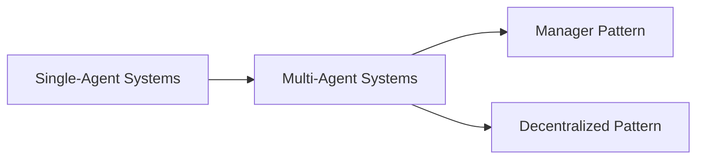
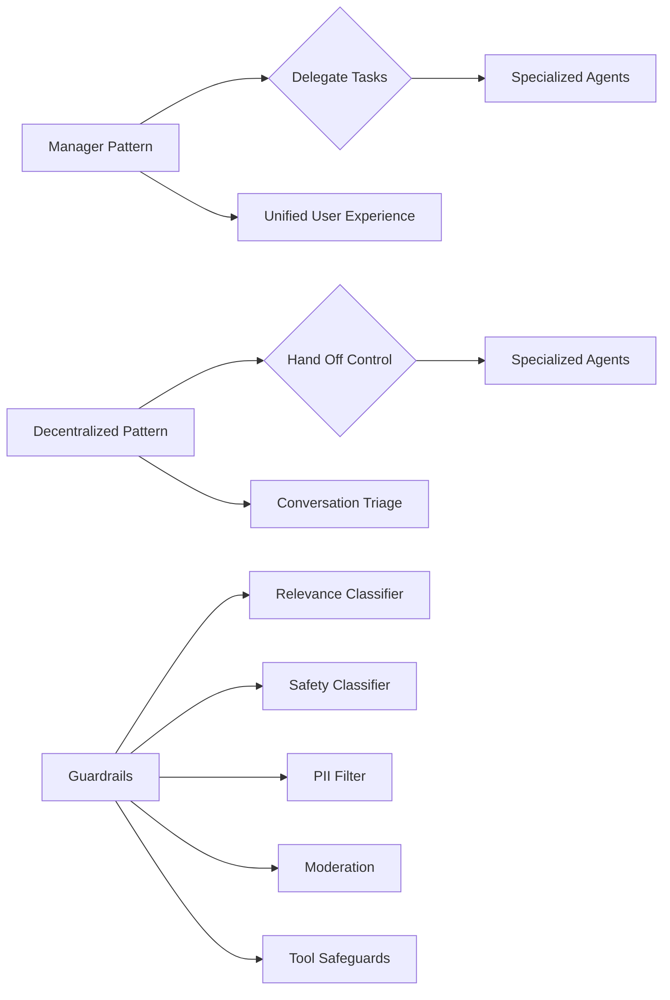
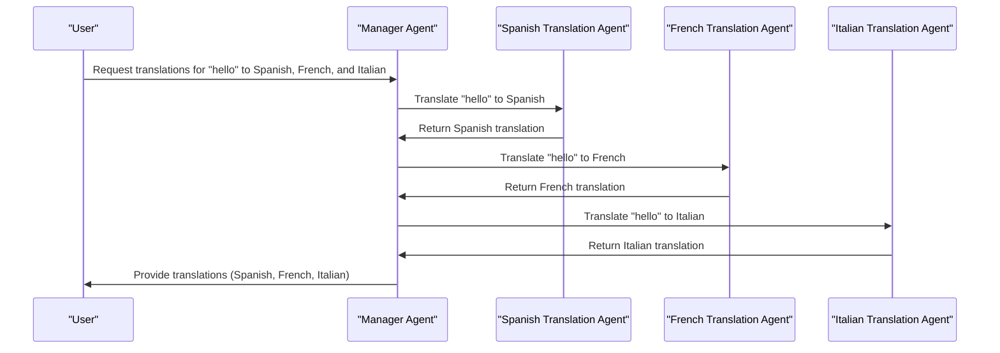

# 📚 A-Practical-Guide-To-Building-Agents

**Academic Level:** Graduate
**Document Type:** document
**Total Pages:** 34
**Total Chapters:** 2

---

## 📋 Document Overview

These comprehensive study notes cover all content from the source document, organized hierarchically and formatted for optimal learning at the graduate level.


---

## 🔍 Chapter 1: Pages 1-16

## Pages 1-16: A Practical Guide to Building Agents
### Introduction
The guide provides practical and actionable best practices for building agents, focusing on Large Language Models (LLMs) and their applications. Agents are systems that independently accomplish tasks on behalf of users, leveraging LLMs to manage workflow execution and make decisions.

### What is an Agent?
#### Definition and Characteristics
An agent is a system that:
* Independently accomplishes tasks on behalf of users
* Leverages an LLM to manage workflow execution and make decisions
* Recognizes when a workflow is complete and can proactively correct actions if needed
* Has access to various tools to interact with external systems
* Dynamically selects the appropriate tools depending on the workflow's current state, operating within clearly defined guardrails

#### Key Characteristics:
1. **LLM-powered decision-making**: Agents use LLMs to manage workflow execution and make decisions.
2. **Tool usage**: Agents have access to various tools to interact with external systems.
3. **Autonomy**: Agents can independently accomplish tasks on behalf of users.

### When Should You Build an Agent?
#### Use Cases
Consider building an agent for workflows that:
* Involve complex decision-making with nuanced judgment and exceptions
* Have difficult-to-maintain rules with extensive and intricate rulesets
* Rely heavily on unstructured data, such as natural language or documents

#### Prioritization
Prioritize workflows that have previously resisted automation, especially where traditional methods encounter friction.

### Agent Design Foundations
#### Core Components
An agent consists of three core components:
1. **Model**: The LLM powering the agent's reasoning and decision-making
2. **Tools**: External functions or APIs the agent can use to take action
3. **Instructions**: Explicit guidelines and guardrails defining how the agent behaves

#### Model Selection
* Different models have different strengths and tradeoffs related to task complexity, latency, and cost.
* Consider using a variety of models for different tasks in the workflow.

#### Tool Definition
* Tools extend the agent's capabilities by using APIs from underlying applications or systems.
* Each tool should have a standardized definition, enabling flexible, many-to-many relationships between tools and agents.

#### Instruction Configuration
* High-quality instructions are essential for any LLM-powered app, especially critical for agents.
* Clear instructions reduce ambiguity and improve agent decision-making.

### Best Practices for Agent Instructions
* Use existing documents, such as operating procedures or policy documents.
* Prompt agents to break down tasks into smaller, clearer steps.
* Define clear actions for each step in the routine.
* Capture edge cases and anticipate common variations.

### Orchestration
#### Single-Agent Systems
* A single agent can handle many tasks by incrementally adding tools.
* Keep complexity manageable and simplify evaluation and maintenance.

#### Multi-Agent Systems
* Multi-agent systems can be designed in numerous ways for specific workflows and requirements.
* Two broadly applicable categories:
	+ **Manager Pattern**: A central "manager" agent coordinates multiple specialized agents via tool calls.
	+ **Decentralized Pattern**: Multiple agents operate as peers, handing off tasks to one another based on their specializations.

### Practical Guidelines for Splitting Agents
* **Complex Logic**: Divide each logical segment across separate agents when prompts contain many conditional statements.
* **Tool Overload**: Use multiple agents if improving tool clarity doesn't improve performance.

### Guardrails
* Guardrails are essential for ensuring agents operate within defined boundaries.
* They prevent agents from taking actions that may be harmful or undesirable.

### Conclusion
* Building agents requires rethinking how systems make decisions and handle complexity.
* Agents are uniquely suited to workflows where traditional deterministic and rule-based approaches fall short.
* By following the guide, product and engineering teams can build their first agents with confidence.

## Detailed Notes

### Agent Definition and Characteristics
```markdown
## Agent Definition
An agent is a system that independently accomplishes tasks on behalf of users.

## Key Characteristics
1. **LLM-powered decision-making**: Agents use LLMs to manage workflow execution and make decisions.
2. **Tool usage**: Agents have access to various tools to interact with external systems.
3. **Autonomy**: Agents can independently accomplish tasks on behalf of users.
```

### Use Cases for Agents
```markdown
## Use Cases
Consider building an agent for workflows that:

1. **Involve complex decision-making**: Workflows with nuanced judgment and exceptions.
2. **Have difficult-to-maintain rules**: Workflows with extensive and intricate rulesets.
3. **Rely heavily on unstructured data**: Workflows that involve natural language or documents.
```

### Agent Design Foundations
```markdown
## Core Components
An agent consists of three core components:

1. **Model**: The LLM powering the agent's reasoning and decision-making.
2. **Tools**: External functions or APIs the agent can use to take action.
3. **Instructions**: Explicit guidelines and guardrails defining how the agent behaves.
```

### Model Selection
```python
## Model Selection
def select_model(task_complexity, latency, cost):
    # Define a function to select a model based on task complexity, latency, and cost
    pass
```

### Tool Definition
```markdown
## Tool Definition
Tools extend the agent's capabilities by using APIs from underlying applications or systems.

## Tool Types
1. **Data**: Enable agents to retrieve context and information.
2. **Action**: Enable agents to interact with systems to take actions.
```

### Instruction Configuration
```markdown
## Instruction Configuration
High-quality instructions are essential for any LLM-powered app, especially critical for agents.

## Best Practices
1. **Use existing documents**: Use operating procedures or policy documents.
2. **Prompt agents to break down tasks**: Break down tasks into smaller, clearer steps.
3. **Define clear actions**: Define clear actions for each step in the routine.
4. **Capture edge cases**: Anticipate common variations and edge cases.
```

### Orchestration


### Practical Guidelines for Splitting Agents
```markdown
## Practical Guidelines
1. **Complex Logic**: Divide each logical segment across separate agents.
2. **Tool Overload**: Use multiple agents if improving tool clarity doesn't improve performance.
```

### Guardrails
```markdown
## Guardrails
Guardrails are essential for ensuring agents operate within defined boundaries.

## Importance
1. **Prevent harm**: Prevent agents from taking actions that may be harmful or undesirable.
2. **Ensure reliability**: Ensure agents operate reliably and consistently.
```

---

## 🔍 Chapter 2: Pages 19-33

## Manager Pattern
### Overview

The manager pattern is a design approach that empowers a central Large Language Model (LLM) - the "manager" - to orchestrate a network of specialized agents seamlessly through tool calls. This pattern ensures a smooth, unified user experience, with specialized capabilities always available on-demand.

### Key Characteristics

*   A central manager agent controls workflow execution and has access to the user.
*   The manager intelligently delegates tasks to the right agent at the right time.
*   The manager synthesizes results into a cohesive interaction.

### Ideal Use Cases

*   Workflows where one agent should control execution and have access to the user.
*   Scenarios requiring a unified user experience.

### Implementation Example

```python
from agents import Agent, Runner

# Define the manager agent
manager_agent = Agent(
    name="manager_agent",
    instructions=(
        "You are a translation agent. You use the tools given to you to translate."
        "If asked for multiple translations, you call the relevant tools."
    ),
    tools=[
        spanish_agent.as_tool(
            tool_name="translate_to_spanish",
            tool_description="Translate the user's message to Spanish",
        ),
        french_agent.as_tool(
            tool_name="translate_to_french",
            tool_description="Translate the user's message to French",
        ),
        italian_agent.as_tool(
            tool_name="translate_to_italian",
            tool_description="Translate the user's message to Italian",
        ),
    ],
)

# Run the manager agent
async def main():
    msg = input("Translate 'hello' to Spanish, French and Italian for me!")
    orchestrator_output = await Runner.run(manager_agent, msg)
    for message in orchestrator_output.new_messages:
        print(f" - Translation step: {message.content}")

```

## Declarative vs Non-Declarative Graphs

### Declarative Graphs

*   Require explicit definition of every branch, loop, and conditional in the workflow upfront.
*   Use graphs consisting of nodes (agents) and edges (deterministic or dynamic handoffs).
*   Can be cumbersome and challenging as workflows grow more dynamic and complex.

### Non-Declarative Graphs

*   Adopt a more flexible, code-first approach.
*   Allow developers to express workflow logic using familiar programming constructs.
*   Enable more dynamic and adaptable agent orchestration.

## Decentralized Pattern

### Overview

In a decentralized pattern, agents can 'handoff' workflow execution to one another. This pattern involves using many agents on equal footing, where one agent can directly hand off control of the workflow to another agent.

### Key Characteristics

*   Agents can hand off control to each other.
*   No central manager agent.
*   Suitable for scenarios like conversation triage or when specialized agents should fully take over certain tasks.

### Ideal Use Cases

*   Scenarios where specialized agents should fully take over certain tasks without the original agent needing to remain involved.
*   Conversation triage.

### Implementation Example

```python
from agents import Agent, Runner

# Define agents
technical_support_agent = Agent(
    name="Technical Support Agent",
    instructions=(
        "You provide expert assistance with resolving technical issues, system outages, or product troubleshooting."
    ),
    tools=[search_knowledge_base],
)

sales_assistant_agent = Agent(
    name="Sales Assistant Agent",
    instructions=(
        "You help enterprise clients browse the product catalog, recommend suitable solutions, and facilitate purchase transactions."
    ),
    tools=[initiate_purchase_order],
)

# Define triage agent
triage_agent = Agent(
    name="Triage Agent",
    instructions=(
        "You act as the first point of contact, assessing customer queries and directing them promptly to the correct specialized agent."
    ),
    handoffs=[technical_support_agent, sales_assistant_agent],
)

# Run the triage agent
await Runner.run(
    triage_agent,
    input("Could you please provide an update on the delivery timeline for our recent purchase?")
)

```

## Guardrails

### Overview

Guardrails are a critical component of any LLM-based deployment, helping manage data privacy risks and reputational risks. They can be used to prevent system prompt leaks, enforce brand-aligned model behavior, and more.

### Types of Guardrails

*   **Relevance Classifier**: Ensures agent responses stay within the intended scope by flagging off-topic queries.
*   **Safety Classifier**: Detects unsafe inputs (jailbreaks or prompt injections) that attempt to exploit system vulnerabilities.
*   **PII Filter**: Prevents unnecessary exposure of personally identifiable information (PII) by vetting model output for any potential PII.
*   **Moderation**: Flags harmful or inappropriate inputs (hate speech, harassment, violence) to maintain safe, respectful interactions.
*   **Tool Safeguards**: Assess the risk of each tool available to your agent by assigning a rating (low, medium, or high) based on factors like read-only vs. write access, reversibility, required account permissions, and financial impact.

### Building Guardrails

1.  Focus on data privacy and content safety.
2.  Add new guardrails based on real-world edge cases and failures encountered.
3.  Optimize for both security and user experience.

### Implementation Example

```python
from agents import (
    Agent,
    GuardrailFunctionOutput,
    InputGuardrailTripwireTriggered,
    RunContextWrapper,
    Runner,
)

# Define a guardrail function
@input_guardrail
async def churn_detection_tripwire(
    ctx: RunContextWrapper[None], agent: Agent, input: str | list[TResponseInputItem]
) -> GuardrailFunctionOutput:
    result = await Runner.run(churn_detection_agent, input, context=ctx.context)
    return GuardrailFunctionOutput(
        output_info=result.final_output,
        tripwire_triggered=result.final_output.is_churn_risk,
    )

# Define an agent with a guardrail
customer_support_agent = Agent(
    name="Customer support agent",
    instructions=(
        "You are a customer support agent. You help customers with their questions."
    ),
    input_guardrails=[
        Guardrail(guardrail_function=churn_detection_tripwire),
    ],
)

```

## Plan for Human Intervention

### Overview

Human intervention is a critical safeguard enabling you to improve an agent's real-world performance without compromising user experience. It's especially important early in deployment, helping identify failures, uncover edge cases, and establish a robust evaluation cycle.

### Triggers for Human Intervention

*   **Exceeding Failure Thresholds**: Set limits on agent retries or actions. If the agent exceeds these limits, escalate to human intervention.
*   **High-Risk Actions**: Actions that are sensitive, irreversible, or have high stakes should trigger human oversight.

## Conclusion

Agents mark a new era in workflow automation, where systems can reason through ambiguity, take action across tools, and handle multi-step tasks with a high degree of autonomy. To build reliable agents, start with strong foundations, pair capable models with well-defined tools and clear, structured instructions, and use orchestration patterns that match your complexity level. Guardrails are critical at every stage, and human intervention is essential for improving agent performance and handling edge cases.

## Comparison of Manager and Decentralized Patterns

|  **Characteristics**  | **Manager Pattern** | **Decentralized Pattern** |
|  --------------------  | -------------------- | ------------------------- |
|  **Control**           | Central manager agent | No central manager agent  |
|  **Agent Interaction** | Manager delegates tasks | Agents hand off control    |
|  **Use Cases**         | Unified user experience, single agent control | Conversation triage, specialized agents |

## Guardrail Types and Functions

|  **Guardrail Type**  | **Function** |
|  --------------------  | ------------ |
|  Relevance Classifier  | Flags off-topic queries |
|  Safety Classifier    | Detects unsafe inputs   |
|  PII Filter           | Prevents PII exposure   |
|  Moderation           | Flags harmful inputs    |
|  Tool Safeguards      | Assess tool risk        |

## Methodological Considerations

When building agents, consider the following:

*   **Start Small**: Validate with real users and grow capabilities over time.
*   **Strong Foundations**: Pair capable models with well-defined tools and clear, structured instructions.
*   **Guardrails**: Critical at every stage, from input filtering to human-in-the-loop intervention.

## Future Directions

*   **Iterative Approach**: Continuously improve agent performance and adapt to changing requirements.
*   **Human-in-the-Loop**: Essential for handling edge cases and improving agent reliability.

## References

*   OpenAI API Platform
*   OpenAI for Business
*   OpenAI Stories
*   ChatGPT Enterprise
*   OpenAI and Safety
*   Developer Docs

## Additional Resources

*   [OpenAI Website](https://www.openai.com)
*   [OpenAI Research](https://www.openai.com/research)

## Mermaid Diagram: Agent Orchestration Patterns





