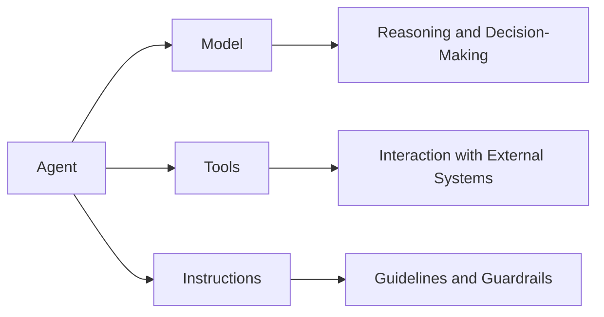
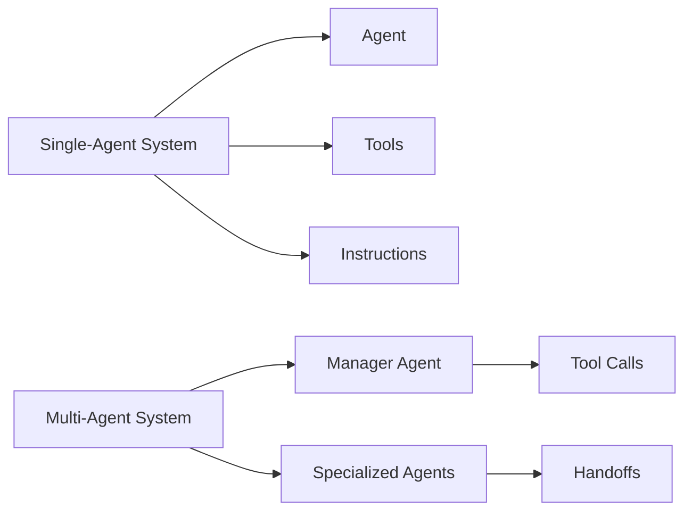
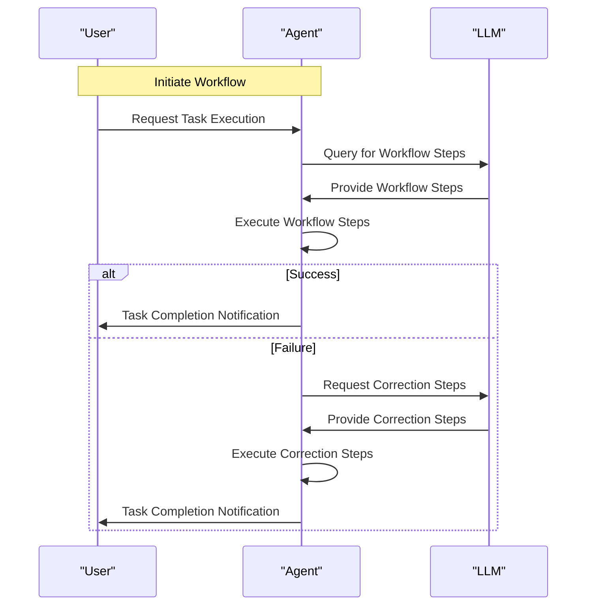

# 📚 A-Practical-Guide-To-Building-Agents

**Academic Level:** Graduate
**Document Type:** document
**Total Pages:** 34
**Total Chapters:** 2

---

## 📋 Document Overview

These comprehensive study notes cover all content from the source document, organized hierarchically and formatted for optimal learning at the graduate level.


---

## 🔍 Chapter 1: Pages 1-16

## Comprehensive Notes for Section: Pages 1-16
### Introduction to Agents and OpenAI

#### What is an Agent?
An agent is a system that independently accomplishes tasks on behalf of a user. It leverages a large language model (LLM) to manage workflow execution and make decisions. Agents can handle complex, multi-step tasks and have access to various tools to interact with external systems.

#### Key Characteristics of an Agent
*   It leverages an LLM to manage workflow execution and make decisions.
*   It recognizes when a workflow is complete and can proactively correct its actions if needed.
*   It has access to various tools to interact with external systems and dynamically selects the appropriate tools depending on the workflow's current state.

#### When to Build an Agent
Building agents requires rethinking how systems make decisions and handle complexity. Agents are suited for workflows where traditional deterministic and rule-based approaches fall short. Consider building an agent for:
*   Complex decision-making: workflows involving nuanced judgment, exceptions, or context-sensitive decisions.
*   Difficult-to-maintain rules: systems with extensive and intricate rulesets, making updates costly or error-prone.
*   Heavy reliance on unstructured data: scenarios involving interpreting natural language, extracting meaning from documents, or interacting with users conversationally.

### Agent Design Foundations

#### Components of an Agent
An agent consists of three core components:
1.  **Model**: The LLM powering the agent's reasoning and decision-making.
2.  **Tools**: External functions or APIs the agent can use to take action.
3.  **Instructions**: Explicit guidelines and guardrails defining how the agent behaves.

#### Selecting a Model
*   Different models have different strengths and tradeoffs related to task complexity, latency, and cost.
*   Consider using a variety of models for different tasks in the workflow.
*   Principles for choosing a model:
    1.  Set up evals to establish a performance baseline.
    2.  Focus on meeting accuracy targets with the best models available.
    3.  Optimize for cost and latency by replacing larger models with smaller ones where possible.

#### Defining Tools
*   Tools extend an agent's capabilities by using APIs from underlying applications or systems.
*   Agents need three types of tools:
    *   **Data**: enable agents to retrieve context and information necessary for executing the workflow.
    *   **Action**: enable agents to interact with systems to take actions.
    *   **Agents as tools**: agents themselves can serve as tools for other agents.

#### Configuring Instructions
*   High-quality instructions are essential for LLM-powered apps, especially for agents.
*   Best practices for agent instructions:
    *   Use existing documents.
    *   Prompt agents to break down tasks.
    *   Define clear actions.
    *   Capture edge cases.

### Orchestration Patterns

#### Single-Agent Systems
*   A single agent can handle many tasks by incrementally adding tools.
*   Orchestration approach:
    *   Concept of a 'run', typically implemented as a loop that lets agents operate until an exit condition is reached.
    *   Exit conditions: tool calls, a certain structured output, errors, or reaching a maximum number of turns.

#### Multi-Agent Systems
*   Two broadly applicable categories:
    1.  **Manager (agents as tools)**: a central "manager" agent coordinates multiple specialized agents via tool calls.
    2.  **Decentralized (agents handing off to agents)**: multiple agents operate as peers, handing off tasks to one another based on their specializations.

### Guardrails
Guardrails are essential for ensuring agents operate safely, predictably, and effectively.

### Conclusion
*   Agents have the potential to transform workflows and decision-making processes.
*   By understanding agent design foundations and orchestration patterns, teams can build effective agents that add value to their organizations.

## Detailed Analysis and Theoretical Frameworks

### Agent Theory
The concept of an agent is rooted in agent theory, which studies autonomous entities that can perceive their environment, make decisions, and take actions.

### Decision-Making Frameworks
Agents can be designed using decision-making frameworks such as decision theory, game theory, or planning-based approaches.

### Human-Computer Interaction
Agents can be viewed as a form of human-computer interaction, where the agent serves as an intermediary between the user and the system.

## Practical Applications and Research Implications

### Real-World Applications
Agents have numerous real-world applications, including:
*   Customer service: agents can handle customer inquiries and provide support.
*   Financial analysis: agents can analyze financial data and make recommendations.

### Research Directions
Future research directions include:
*   Improving agent decision-making and reasoning capabilities.
*   Developing more sophisticated orchestration patterns.
*   Investigating the impact of agents on human-computer interaction.

## Methodological Considerations

### Evaluation Metrics
Agents can be evaluated using metrics such as accuracy, efficiency, and user satisfaction.

### Experimental Design
Experimental design is crucial for testing and evaluating agent performance.

### Data Collection and Analysis
Data collection and analysis are essential for understanding agent behavior and identifying areas for improvement.

## Connection to Broader Academic Discourse

### Artificial Intelligence
Agents are a key area of research in artificial intelligence, with connections to machine learning, natural language processing, and computer vision.

### Human-Computer Interaction
Agents have implications for human-computer interaction, including the design of user interfaces and the study of human behavior.

### Cognitive Science
Agents can be viewed as cognitive systems, with connections to cognitive science and the study of human cognition.

## Critical Analysis
A critical analysis of agents reveals both opportunities and challenges, including:
*   The potential for agents to transform workflows and decision-making processes.
*   The need for careful design and evaluation to ensure agent effectiveness.
*   The importance of considering ethical and social implications.

## Code Blocks and Formulas

### Agent Implementation
```python
weather_agent = Agent(
    name="Weather agent",
    instructions="You are a helpful agent who can talk to users about the weather.",
    tools=[get_weather],
)
```

### Model Evaluation
```python
# Evaluate model performance
model_evaluation = evaluate_model(model, data)
print(model_evaluation)
```

## Mermaid Diagrams

### Agent Architecture


### Orchestration Patterns





---

## 🔍 Chapter 2: Pages 19-33

# Manager Pattern
## Overview
The manager pattern is a design approach that empowers a central Large Language Model (LLM) to orchestrate a network of specialized agents seamlessly through tool calls. This pattern ensures a smooth, unified user experience, with specialized capabilities always available on-demand.

### Key Characteristics

* A central LLM, the "manager," controls workflow execution and has access to the user.
* The manager intelligently delegates tasks to the right agent at the right time.
* The manager synthesizes results into a cohesive interaction.

### Ideal Use Cases

* Workflows where one agent should control execution and have access to the user.
* Scenarios requiring a unified user experience.

### Implementation Example

```python
from agents import Agent, Runner

# Define the manager agent
manager_agent = Agent(
    name="manager_agent",
    instructions=(
        "You are a translation agent. You use the tools given to you to translate."
        "If asked for multiple translations, you call the relevant tools."
    ),
    tools=[
        spanish_agent.as_tool(
            tool_name="translate_to_spanish",
            tool_description="Translate the user's message to Spanish",
        ),
        french_agent.as_tool(
            tool_name="translate_to_french",
            tool_description="Translate the user's message to French",
        ),
        italian_agent.as_tool(
            tool_name="translate_to_italian",
            tool_description="Translate the user's message to Italian",
        ),
    ],
)

# Run the manager agent
async def main():
    msg = input("Translate 'hello' to Spanish, French and Italian for me!")
    orchestrator_output = await Runner.run(manager_agent, msg)
    for message in orchestrator_output.new_messages:
        print(f" - Translation step: {message.content}")

```

## Declarative vs Non-Declarative Graphs
### Overview

* Declarative graphs require explicit definition of every branch, loop, and conditional in the workflow upfront.
* Non-declarative graphs use a code-first approach, allowing for more dynamic and adaptable agent orchestration.

### Declarative Graphs

* **Characteristics:**
	+ Explicitly define every branch, loop, and conditional.
	+ Use graphs consisting of nodes (agents) and edges (deterministic or dynamic handoffs).
	+ Often require learning specialized domain-specific languages.
* **Benefits:**
	+ Provide visual clarity.
* **Drawbacks:**
	+ Can become cumbersome and challenging as workflows grow more dynamic and complex.

### Non-Declarative Graphs

* **Characteristics:**
	+ Use a code-first approach.
	+ Allow for more dynamic and adaptable agent orchestration.
	+ Do not require explicit definition of every branch, loop, and conditional.
* **Benefits:**
	+ More flexible and scalable.
* **Drawbacks:**
	+ May lack visual clarity.

## Decentralized Pattern
### Overview

* The decentralized pattern involves using many agents on equal footing, where one agent can directly hand off control of the workflow to another agent.
* This pattern is optimal when you don't need a single agent maintaining central control or synthesis.

### Key Characteristics

* Agents can 'handoff' workflow execution to one another.
* Handoffs are one-way transfers that allow an agent to delegate to another agent.

### Implementation Example

```python
from agents import Agent, Runner

# Define agents
technical_support_agent = Agent(
    name="Technical Support Agent",
    instructions=(
        "You provide expert assistance with resolving technical issues, system outages, or product troubleshooting."
    ),
    tools=[search_knowledge_base]
)

sales_assistant_agent = Agent(
    name="Sales Assistant Agent",
    instructions=(
        "You help enterprise clients browse the product catalog, recommend suitable solutions, and facilitate purchase transactions."
    ),
    tools=[initiate_purchase_order]
)

order_management_agent = Agent(
    name="Order Management Agent",
    instructions=(
        "You assist clients with inquiries regarding order tracking, delivery schedules, and processing returns or refunds."
    ),
    tools=[track_order_status, initiate_refund_process]
)

triage_agent = Agent(
    name="Triage Agent",
    instructions=(
        "You act as the first point of contact, assessing customer queries and directing them promptly to the correct specialized agent."
    ),
    handoffs=[technical_support_agent, sales_assistant_agent, order_management_agent],
)

# Run the triage agent
await Runner.run(
    triage_agent,
    input("Could you please provide an update on the delivery timeline for our recent purchase?")
)

```

## Guardrails
### Overview

* Guardrails are a critical component of any LLM-based deployment, helping to manage data privacy risks and reputational risks.
* Guardrails can be used to prevent system prompt leaks, enforce brand-aligned model behavior, and maintain safe interactions.

### Types of Guardrails

* **Relevance Classifier:** Ensures agent responses stay within the intended scope by flagging off-topic queries.
* **Safety Classifier:** Detects unsafe inputs (jailbreaks or prompt injections) that attempt to exploit system vulnerabilities.
* **PII Filter:** Prevents unnecessary exposure of personally identifiable information (PII) by vetting model output for any potential PII.
* **Moderation:** Flags harmful or inappropriate inputs (hate speech, harassment, violence) to maintain safe, respectful interactions.
* **Tool Safeguards:** Assess the risk of each tool available to your agent by assigning a rating (low, medium, or high) based on factors like read-only vs. write access, reversibility, required account permissions, and financial impact.

### Implementation Example

```python
from agents import (
    Agent,
    GuardrailFunctionOutput,
    InputGuardrailTripwireTriggered,
    RunContextWrapper,
    Runner,
    TResponseInputItem,
    input_guardrail,
    Guardrail,
    GuardrailTripwireTriggered
)

# Define a guardrail function
@input_guardrail
async def churn_detection_tripwire(
    ctx: RunContextWrapper[None], agent: Agent, input: str | list[TResponseInputItem]
) -> GuardrailFunctionOutput:
    result = await Runner.run(churn_detection_agent, input, context=ctx.context)
    return GuardrailFunctionOutput(
        output_info=result.final_output,
        tripwire_triggered=result.final_output.is_churn_risk,
    )

# Define an agent with a guardrail
customer_support_agent = Agent(
    name="Customer support agent",
    instructions="You are a customer support agent. You help customers with their questions.",
    input_guardrails=[
        Guardrail(guardrail_function=churn_detection_tripwire),
    ],
)

```

## Plan for Human Intervention
### Overview

* Human intervention is a critical safeguard enabling you to improve an agent's real-world performance without compromising user experience.
* Implementing a human intervention mechanism allows the agent to gracefully transfer control when it can't complete a task.

### Triggers for Human Intervention

* **Exceeding Failure Thresholds:** Set limits on agent retries or actions. If the agent exceeds these limits, escalate to human intervention.
* **High-Risk Actions:** Actions that are sensitive, irreversible, or have high stakes should trigger human oversight.

## Conclusion
### Summary

* Agents mark a new era in workflow automation, where systems can reason through ambiguity, take action across tools, and handle multi-step tasks with a high degree of autonomy.
* To build reliable agents, start with strong foundations: pair capable models with well-defined tools and clear, structured instructions.
* Use orchestration patterns that match your complexity level, starting with a single agent and evolving to multi-agent systems only when needed.
* Guardrails are critical at every stage, from input filtering and tool use to human-in-the-loop intervention.

### Future Directions

* Start small, validate with real users, and grow capabilities over time.
* With the right foundations and an iterative approach, agents can deliver real business value-automating not just tasks, but entire workflows with intelligence and adaptability.